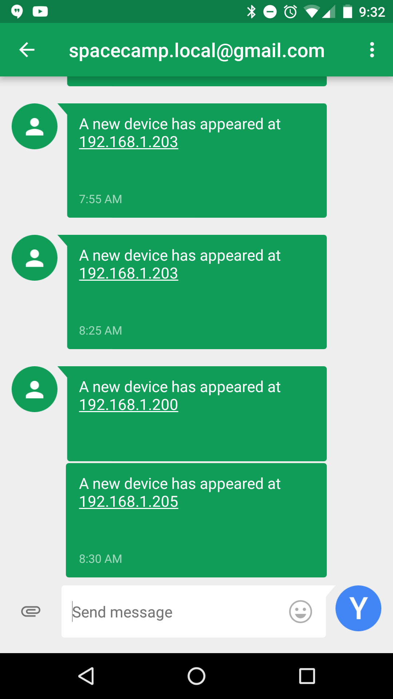

##Get a text message when a new device joins your network.

This guide will walk you through monitoring all active devices on your network with nmap and alerting you via ssmtp when a new device joins your network. This was tested and verified on Debian. YMMV on other devices.

For the purposes of this guide I will be working on the `192.168.1.0/24` network. 

We will be using both `nmap` and `ssmtp` in this guide so make sure that those packages are installed: `sudo apt-get install nmap ssmtp`.

###Understanding NMAP

If you already have a basic understanding of NMAP, skip this section. [NMAP](https://nmap.org/) (network mapper) is a tool for...mapping networks. It is a deep tool used by network admins, pentesters and hackers to map out networks and do discovery on the devices that it finds. 

We'll be using a lightweight, non intrusive scan to find live hosts on our network.

The backbone of our discovery will be `nmap -ns 192.168.1.0/24`. `-ns` tells nmap to run a simply ping scan and not do any port scanning. Note that this will miss any devices on your network that do not respond to pings. 

###Configuring SSMTP

SSMTP will allow us to send email from the command line. You'll want to set up a throwaway gmail account for this purpose. Once you have the login and password for your throwaway account we can edit the SSMTP configuration file.

Open `/etc/ssmtp/ssmtp.conf` in your favorite editor and enter the information below:

```
root=YOUR_FULL_EMAIL_ADDRESS
AuthUser=USERNAME_FROM_EMAIL_ADDRESS
AuthPass=PLAINTEXT_PASSWORD
FromLineOverride=YES
mailhub=smtp.gmail.com:587
UseSTARTTLS=YES
```

Next, log into your gmail account and go to [https://www.google.com/settings/security/lesssecureapps)https://www.google.com/settings/security/lesssecureapps]. You'll need to choose `Turn on` here in order for ssmtp to send emails from this account.

You can test your configuration by sending a test email:

`echo "This is a test" | ssmtp -s "Test" RECIPIENT_EMAIL_ADDRESS`

###Receiving Email As Text

Most carriers should provide you with an email address that will text your number. Usually these take the form of `PHONE_NUMBER@TEXT.GATEWAY`. 

I use Google Fi and found [this helpful article](https://support.google.com/fi/answer/6356597?hl=en) that let me know my email address is `PHONE_NUMBER@msg.fi.google.com`

###Tying It Together

We'll use a simply bash script to scan the network, parse the output, keep a database of known hosts and text you when a new device joins the network.

```
#! /bin/bash

##############
###Variables##
##############

#Location where this program will write out your network map to
NETWORK="network.map"
touch $NETWORK
#The nmap command you'd like to use for client discovery
NMAP=`nmap -sn 192.168.1.0/24`
#The email (SMS) address you would like notified when a new host is discovered
EMAIL="YOUR_PHONE_NUMBER@msg.fi.google.com."

#########
###Code##
#########

IFS=$'\r\n' GLOBIGNORE='*' command eval  'XYZ=($NMAP)'
XYZ=${XYZ[@]:1}

for each in "${XYZ[@]}"; do
       	IP=`echo $each | awk '{ print $(NF) }' | tr -d '()' | grep -E '[0-9]{1,3}\.[0-9]{1,3}\.[0-9]{1,3}\.[0-9]{1,3}'`
       	if ! grep -Fxq "$IP" network.map
       	then
       		echo $IP >> $NETWORK
       		echo "A new device has appeared at $IP" | /usr/sbin/ssmtp -s "Alert" $EMAIL
       	fi
done
```

I suggest commenting out the line that refers to `/usr/sbin/ssmtp` and running the script manually first in order to generate the initial database without texting you for each device in your network. Then comment the line back in and set the script up in cron to run every five minutes.

###Monitoring the network with cron

To edit the crontab for your user run `crontab -e`

Add the following line to the end of your crontab:

```
*/5 * * * * /PATH/TO/YOUR/BASH/SCRIPT.sh
```

###Wrap Up

After following this guide, you should receive a text message similar to the following each time nmap detects a new device on your network:

